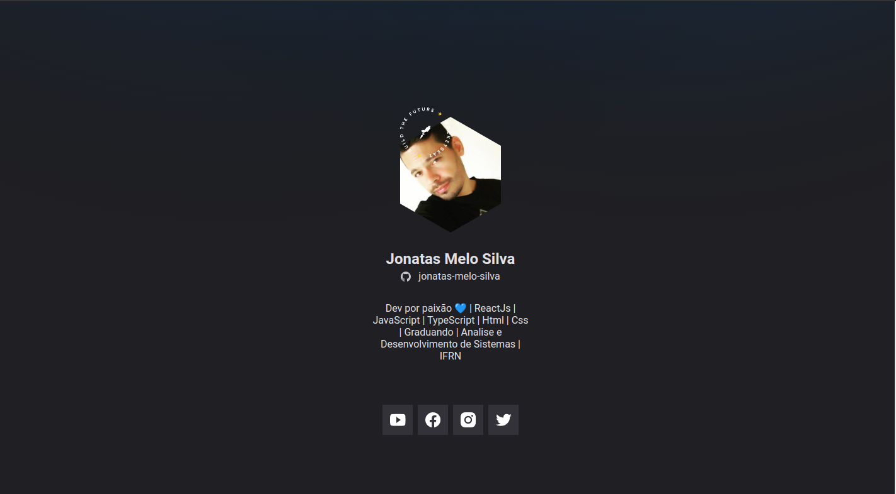

<header>
  <h1 align="center" >💙 NLW HEAT CRACHÁ</h1>
  <h4 align="center" >Find my social networks and between and sends a hi!</h4>
  <br>
  <h2 align="center">📇 Appendix</h2>
  <nav align="center">
    <a align="center" href="#features">Features</a> |
    <a align="center" href="#screenshots">Screenshots</a> |
    <a align="center" href="#video">Video</a> |
    <a align="center" href="#tech-stack">Tech Stack</a> |
    <a align="center" href="#pre-requirements">Pre Requirements</a> |
    <a align="center" href="#running-the-local-project">Running the local project</a> |
    <a align="center" href="#license">License</a> |
    <a align="center" href="#authors">Authors</a>
  </nav>
</header>
<br>
<h4 align="center">👨‍💻️  Construction  🚧️  project  🚀️</h4>
<hr>
<main>
  <section id="features" align="center">
    <h2 align="center">✨ Features</h2>
    <p align="center">
    <strong align="center">
      ✅ Show my github avatar
    </strong>
    <strong align="center">
      ✅ Show my github bio
    </strong>
    <strong align="center">
      ✅ Redirects to the Github profile
    </strong>
    <strong align="center">
      ✅ Lists social networks
    </strong>
    <strong align="center">
      ✅ Redirects for my social networks
    </strong>
    </p>
</section>
<br>
<hr>
<section id="screenshots" align="center">
  <h2 align="center">📸 Screenshots</h2>
  <strong align="center">Layout Mobile</strong>
  <h2></h2>
  <hr>
  <strong align="center">Layout Desktop</strong>
  <h2></h2>
</section>
<br>
<hr>
<section id="video" align="center">
  <h2 align="center">📹 Video</h2>
  <strong align="center">Page Video</strong>
  <h2></h2>
<br>
<hr>
<section id="tech-stack" align="center">
  <h2 align="center">🗄️ Tech Stack</h2>
  <nav>
    <a align="center" href="https://developer.mozilla.org/pt-BR/docs/Web/HTML">Html</a> |
    <a align="center" href="https://developer.mozilla.org/pt-BR/docs/Web/CSS">Css</a> |
    <a align="center" href="https://developer.mozilla.org/pt-BR/docs/Web/JavaScript">JavaScript</a>
    </nav>
</section>
<br>
<hr>
<section id="pre-requirements">
  <h2 align="center">⚠️ Pre-requirements</h2>
  <p align="center">A good browser like Chrome, Firefox, Opera, Safari, etc.</p>
    <a href="https://www.google.com.br/chrome/">Google Chrome</a> |<a href="https://www.mozilla.org/pt-BR/firefox/new/"> Firefox</a> |<a href="https://www.opera.com/pt-br"> Opera</a>.
  </p>
  <p align="center">In addition it is good to have a text editor to work with the code, such as
    <a href="https://code.visualstudio.com/">VSCode</a>.
  </p>
</section>
<br>
<hr>
<section id="running-the-local-project" align="left">
  <h2 align="center">🖥️ Running the local project</h2>

```bash
# Clone the repository
$ git clone <https://github.com/jonatas-melo-silva/nlw-heat-cracha.git>
```

- Access the nlw-heat-cracha project folder
- Just give two clicks in the index.html file

  </section>
  <br>
  <hr>
  <section id="license" align="center">
    <h2 align="center">License</h2>
    <p align="center">
      This project is licensed under the
      <a href="https://choosealicense.com/licenses/mit/">MIT</a> license.
    </p>
  </section>
  <br>
  <hr>
  <section id="authors" align="center">
    <h2 align="center">👨‍💻️ Author 🇧🇷</h2>
    <h4 align="center">Made with 💙 by 🧔‍♂️ <a href="https://github.com/jonatas-melo-silva">Jonatas Melo Silva</a>.</h4>
  </section>
</main>
